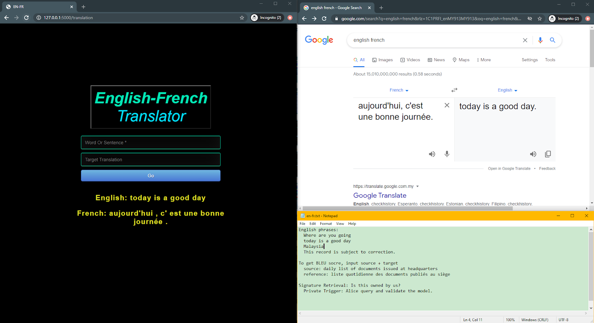
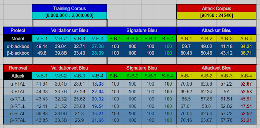

## Statistical RNN Encoder-Decoder
### English to French Neural Machine Translation 



### Dataset: Bilingual Corpora
Europarl , News Commentary, UN, 
Commoncrawl, Gigafren  
[select 10 million by Moore-Lewis algorithm]

### To spin up Flask WebApp 
```
python app.py
```

### Model Development
- Check on `module/` for model architecture and bleu score calculation

### Experiment Result
- Fine-Tune All Layers (FTAL) :
Fine-tuning of all layers.
- Retrain Last Layer (RTLL) :
Re-initializes the penultimate layer weights and updates only the penultimate layer, while all other layers are frozen.
- Retrain All Layers (RTAL) :
Re-initializes the penultimate layer weights, but all layers are updated during fine-tuning.
